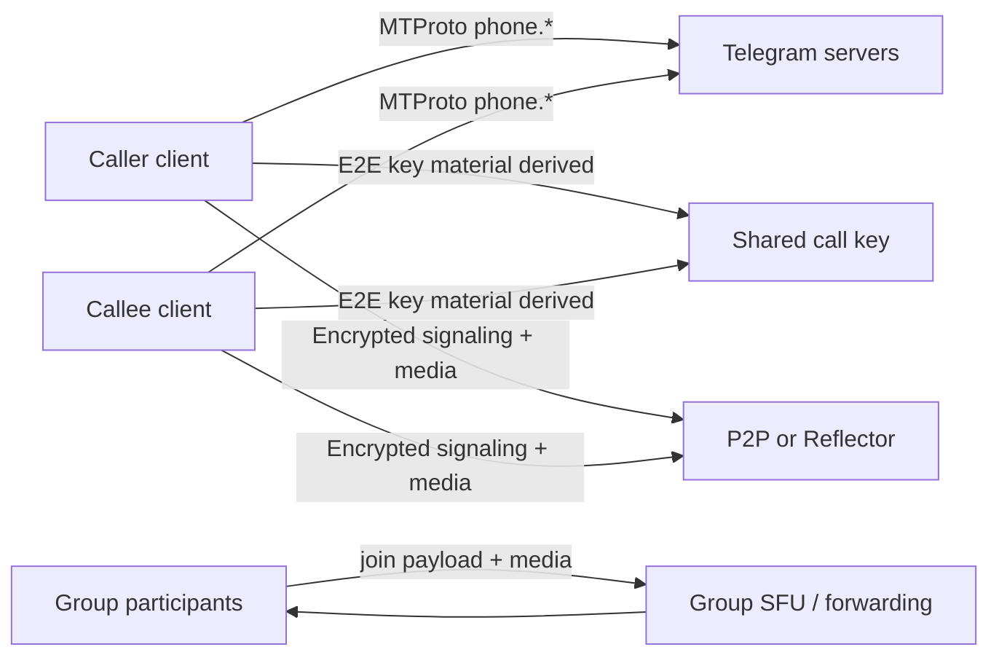

# Threat Model — Telegram Calls (`tgcalls`)

## Assets

- Call media confidentiality (audio/video frames)
- Call signaling integrity (SDP-like negotiation, ICE candidates, control messages)
- Participant identity binding (who is on the other end / in the group)
- Group-call authorization (join, speak, screen share, admin actions)
- Availability of an individual call (lower bounty priority unless linked to security)

## Actors

| Actor | Capabilities |
|-------|----------------|
| Malicious peer (other call participant) | Sends crafted signaling/media after/before keys established |
| Network MitM (path attacker) | Can modify/drop/replay packets on P2P or to reflector; cannot break TLS to MTProto unless separate bug |
| Malicious reflector / SFU vantage | Sees relay traffic; should not learn plaintext if E2E holds |
| Compromised Telegram server (limited) | Controls MTProto signaling, reflector assignment, group blockchain ordering — clients must still detect MitM via verification where designed |
| Local malware | Out of bounty scope unless Telegram mishandles secrets in logs/IPC |

## Trust boundaries

## High-value failure modes

1. **MitM without detection** — attacker relays call, emoji/commit-reveal fails open
2. **Unauthenticated decrypt / weak framing** — forge signaling after guessing/missing MAC checks
3. **Memory corruption on parse** — overflow/OOB on media or call-data lengths → RCE in client
4. **Group join spoof** — appear as another user / subscribe to others’ streams illegally
5. **Key/log leak** — secrets written to stats/logs

## Assumptions

- Upstream WebRTC has its own bugs; we prioritize **Telegram wrappers** and custom crypto/framing in `tgcalls`
- Bounty cares about realistic unauthorized access to private user data or meaningful client compromise
- Testing stays local/static; no targeting third-party accounts
